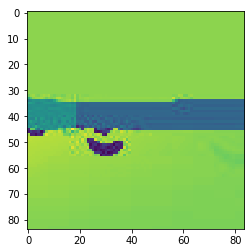

[//]: # (Image References)

# Navigation by Grayscale Pixels - Report
The following report displays the results for the Agent trained by the *preprocessed raw pixels* of the Unity environment. 
### Settings

- Python version: *3.6*
- PyTorch: *1.4.0 and 1.5.0*
- Cuda: *CUDAToolkit 10.1*
- Operating system: *Ubuntu 18.04 and 20.04*
- Unity environment: *VisualBanana.x86_64* provided by Udacity can be downloaded [here](https://s3-us-west-1.amazonaws.com/udacity-drlnd/P1/Banana/VisualBanana_Linux.zip).

### Preprocessig

The original dimension of the Unity environments output image with 3 x 84 x 84 pixels is reduced to size 1 x 84 x 84. This reduction is achieved by taking the dot-product of the three layers. Each layer will be multiplied with a floating-point number less than or equal to 1. All three floating-point numbers must add to one. Thus it is possible to emphasize the importance of each layer. 
The example below shows this cumputation:
```python
np.dot(state[...,:3], [0.800, 0.200, 0.000])
```
Here, the first layer, `R` contributes 80%, the second layer, `G`  20 %, and the last layer `B`  0% to the result.
In this way, one can control each of the three input layers' contributions to the output layer. 

The choice of these values is crucial as you can see in the example below:
Original RGB image of shape 3 x 84 x 84:

Luminance preprocessing with the values `0.299`for the `R` channel, `0.587` for the `G` channel and `0.114` for the `B` channel:

Manually preprocessing with the values `0.800`for the `R` channel, `0.200` for the `G` channel, and `0.000` for the `B` channel:


As you can see, there are significant differences between the first preprocessing and the second one. 
With the Luminance preprocessing, the banana on the right side is nearly vanished, whereas, with the manual, the second preprocessing, the banana is visible.

### Model

The project has been solved with the help of a 3D convolutional neural network (CNN) consisting of **3 convolutional layers** followed by **2 linear layers**:

- The input to the network is of size / dimension 3 x 84 x 84 x 4
	- One input image is of size 84 x 84 pixels
	- Each input image has three color layers (RGB)
	- To get the motion information four images are stacked together
- The firts hidden layer convolves 128 filter of dimension 1 x 3 x 3 (depth = 1), stride of dimension 1 x 3 x 3 and zero padding to the input image and applies a 3D batch normalization followd by a rectifier nonlinearity.
- The second hidden layer convolves 256 filter of dimension 1 x 3 x 3 (depth = 1), stride of dimension 1 x 3 x 3 and zero padding followed by a 3D batch normalization and a rectifier nonlinearity.
- The third hidden layer convolves 256 filter of dimension 4 x 3 x 3 (depth = 4), stride of dimension 1 x 3 x 3 and zero padding followed by a 3D batch normalization and a rectifier nonlinearity.
- The last hidden layer is fully connected with 1024 rectifier units.
- The output layer is again fully connected with 4 outputs (= size of the action space).

### Agent

The project has been solved with a **DQN** and a **Double-DQN** agent. 

- The replay buffer size is 1000
- The batch size is 64
- Gamma = 0.99
- Tau = 0.001 (for soft update of target parameters)
- Learning rate = 0.0005
- The weights will be updated every 4 steps
The Implementation of the Double-DQN agent is done according to [`Mnih et al., 2015`](https://storage.googleapis.com/deepmind-media/dqn/DQNNaturePaper.pdf) and  [`van Hasselt et al., 2015`](https://arxiv.org/pdf/1509.06461.pdf)

### Training

The maximum number of training episodes is 1400.
The maximum number of timesteps per episode is 1000.
The starting value of epsilon, for epsilon-greedy action selection is 1.0.
The minimum value of epsilon is 0.1
The multiplicative factor (per episode) for decreasing epsilon is 0.995.

### Result

The result of training a DQN agent is shown in the plot below: 


As you can see, the agent did not reach the value of 12 (or 13) within the 1400 episodes. 

### Further improvements
An essential aspect of improving the agent seems to be the preprocessing of the original RGB image. 

The agent can also be further improved by incorporating the Dueling Double-DQN and the Prioritized Experience Replay techniques.  
