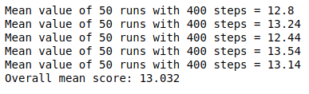

[//]: # (Image References)

# Navigation by Pixels - Report
The following report displays the results for the Agent trained by the *raw pixels* of the Unity environment. 
### Settings

- Python version: *3.6*
- PyTorch: *1.4.0 and 1.5.0*
- Cuda: *CUDAToolkit 10.1*
- Operating system: *Ubuntu 18.04 and 20.04*
- Unity environment: *VisualBanana.x86_64* provided by Udacity can be downloaded [here](https://s3-us-west-1.amazonaws.com/udacity-drlnd/P1/Banana/VisualBanana_Linux.zip).

### Model

The project has been solved with the help of a 3D convolutional neural network (CNN) consisting of **3 convolutional layers** followed by **2 linear layers**:

- The input to the network is of size / dimension 3 x 84 x 84 x 4
	- One imput image is of size 84 x 84 pixels
	- Each input immage has 3 color layers (RGB)
	- To get the motion information 4 images are stacked together
- The firts hidden layer convolves 128 filter of dimension 1 x 3 x 3 (depth = 1), stride of dimension 1 x 3 x 3 and zero padding to the input image and applies a 3D batch normalization followd by a rectifier nonlinearity.
- The second hidden layer convolves 256 filter of dimension 1 x 3 x 3 (depth = 1), stride of dimension 1 x 3 x 3 and zero padding followed by a 3D batch normalization and a rectifier nonlinearity.
- The third hidden layer convolves 256 filter of dimension 4 x 3 x 3 (depth = 4), stride of dimension 1 x 3 x 3 and zero padding followed by a 3D batch normalization and a rectifier nonlinearity.
- The last hidden layer is fully connected with 1024 rectifier units.
- The output layer is again fully connected with 4 outputs (= size of the action space).

### Agent

The project has been solved with a **DQN** and a **Double-DQN** agent. 

- The replay buffer size is 1000
- The batch size is 64
- Gamma = 0.99
- Tau = 0.001 (for soft update of target parameters)
- Learning rate = 0.0005
- The weights will be updated every 4 steps
The Implementation of the Double-DQN agent is done according to [`Mnih et al., 2015`](https://storage.googleapis.com/deepmind-media/dqn/DQNNaturePaper.pdf) and  [`van Hasselt et al., 2015`](https://arxiv.org/pdf/1509.06461.pdf)

### Training

The maximum number of training episodes is 2000.
The maximum number of timesteps per episode is 1000.
The starting value of epsilon, for epsilon-greedy action selection is 1.0.
The minimum value of epsilon is 0.1
The multiplicative factor (per episode) for decreasing epsilon is 0.995.

### Result

The result of training a Double-DQN agent is shown in the plot below: 

The result of training a DQN agent is shown in the plot below: 

The validation of the DQN agent is shown in the plot below: 

For training purposses the score has been limited to +12.

### Further improvements

The agent can be further improved by incorporating the Dueling Double-DQN and the Prioritized Experience Replay techniques. 
